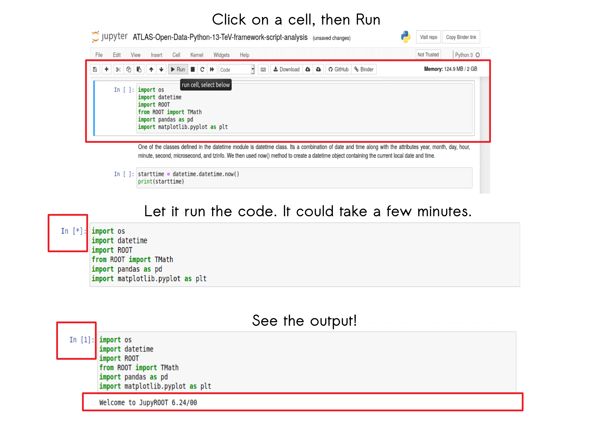

# Sneak Peek: Scientific Computing
### A project for integrating the ATLAS Virtual Machine, ATLAS Open Data Jupyter Notebooks and the Git and Zenodo platforms for Open Science and Reproducibility 
<CENTER></CENTER>

## About the project

Taking advantage of the open science approach of the ATLAS Open Data project, which introduces students in how to perform data analysis in high-energy physics, the project was focused on the improvement of the ATLAS Open Data Jupyter Notebooks with a Python framework script: by automating, making the running of cells more interactive with the user, and by expanding the documentation make them easier to understand. And as part of encouraging Open Science with the tools that ATLAS, CERN and Git offer, an assistant program that integrates the Git commands and Zenodo REST API was designed to be used in the ATLAS Virtual Machine, for promoting the concepts of open science and reproducibility.


## Repository structure

The repository contains this README file, and a environment.yml file to create an environment in Binder. It also contains three folders: **new-notebook**, **previous-notebooks** and **images**.

#### new-notebook folder:
- README: explains how the notebook works, the files, and the results produced by running it.
- Jupyter Notebook:on the notebook you will find the code necessary to perform the analysis and histrograms. The code cells are interspersed with the explanations of the commands in markdown cells.
- atlas-data: this folder is generated when the notebook is run, the analysis and results are stored in it. 
- notebooks-info: it contains a .csv file that stores the information and description of the analysis that appears when the notebook is running.
_* Note that this notebook is only a preview of what you can find and do with the original Scientific Computing Notebook. It is only intended to compare the previous notebook with the new one. If you want to explore all the analysis, you will have to use the notebook in the Scientific Computing repository*

#### previous-notebooks folder:
- Jupyter Notebooks: you will find two notebooks necessary to perform the analysis and histrograms. The code cells are interspersed with the explanations of the commands in markdown cells.
- atlas-data: this folder is generated when the notebook is run, the analysis and results are stored in it. 

#### images:
-images files: to be used in the README file.

## Why a Sneak peek?

Not everyone has the ATLAS Virtual Machine installed on their computers, and although we encourage you to try the ATLAS Open Data and the Scientific Computing content yourself in the ATLAS Virtual Machine, this sneak peek will show you through a remote server what you can do when you run an ATLAS Open Data Notebook. The ATLAS Virtual Machine experience in your browser! 

## How to Sneak peek?
You are free to explore this repo in any way you want. However, we would like you to evaluate our project by comparing the previous notebooks from ATLAS Open Data Jupyter Notebook to the notebook that we have created for our Scientific Computing project. In order to do so, please:
- Launch binder: 
- Or go to [binder](https://mybinder.org/) and paste the url of this repository: ```https://github.com/ramosmaria/sneak-peek-scientific-computing/```
- Press launch and wait for the JupyterHub environment to interact with the notebooks in a live environment.
- Go to the previous-notebooks folder, pick a notebook and run the cells.
- After the analysis from the previous-notebooks is done, go to the new-notebook folder and run the cells.
- After the analysis from the new-notebook is done, go to: [The Sneak Peek Evaluation](https://forms.gle/BwvP29KR3T2o8MK4A) and share your opinion with us!

## Never used Jupyter?

You just have to open a folder, select the .ipynb files and run the cells!



And you can open a terminal too:


For more information:  
-[Scientific computing: The project repo](https://github.com/Andreatugores/Scientific-computing/)  
-[The ATLAS Open Data previous notebooks](https://github.com/atlas-outreach-data-tools/notebooks-frameworks-opendata)  
-[The ATLAS Open Data C++ framework](https://github.com/atlas-outreach-data-tools/atlas-outreach-cpp-framework-13tev)
